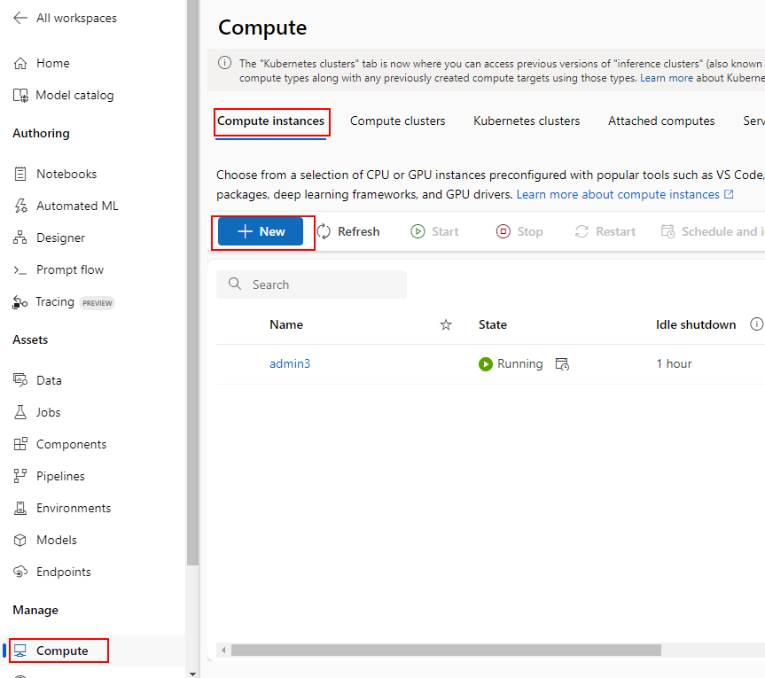
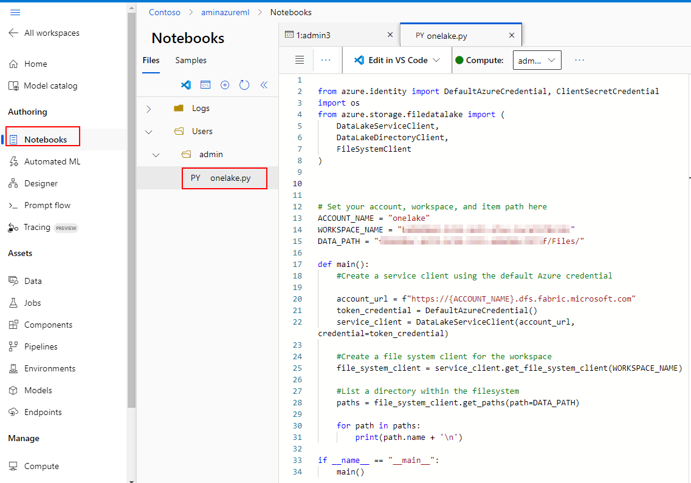
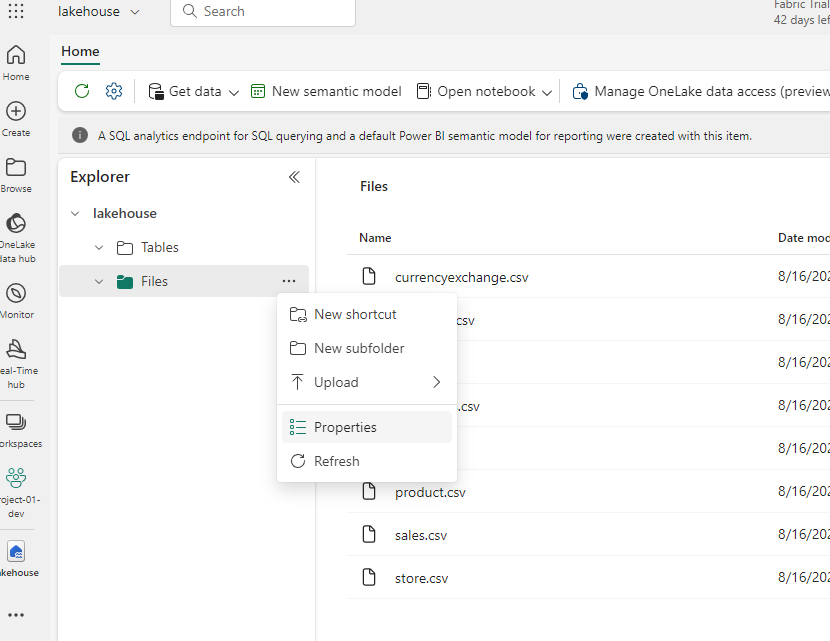
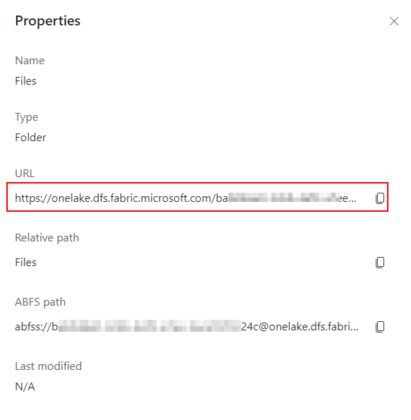
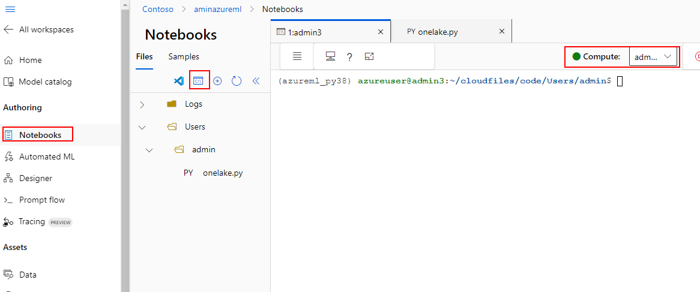
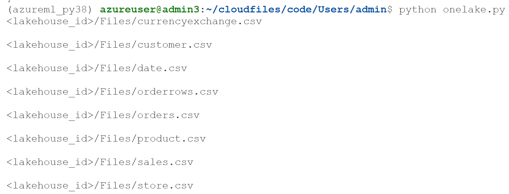

Here is a workaround to access data from OneLake in Azure ML. 

It uses Python and Notebooks to read data from OneLake.

1. Create a compute instance

  

2. From Notebooks create a new .py file or .ipynb. Use the following code: https://learn.microsoft.com/en-us/fabric/onelake/onelake-access-python#sample



3. You can get <myWorkspace> and <myLakehouse> from the Lakehouse properties> URL. The URL is formatted as follows: https://onelake.dfs.fabric.microsoft.com/<myWorkspace>/<myLakehouse>/Files


                                        
4. To run the code in Notebooks, open a terminal and attach it to your compute. 

5. In the command line. install Azure storage and Azure identity packages:```$pip install azure-storage-file-datalake azure-identity```
Navigate to the location of your Python file: For example: ```$cd ~/cloudfiles/code/Users/admin```
6. The code uses Default credentials of the logged in user from the command line. Login using using: ```$az login --identity```
7. Make sure the logged in user has access to the files in the Fabric Lakehouse
8. Run the Python file to list the files in the OneLake/Files directory: ```$python ./onelake.py```
9. If it succeeds, you should see the files listed:

